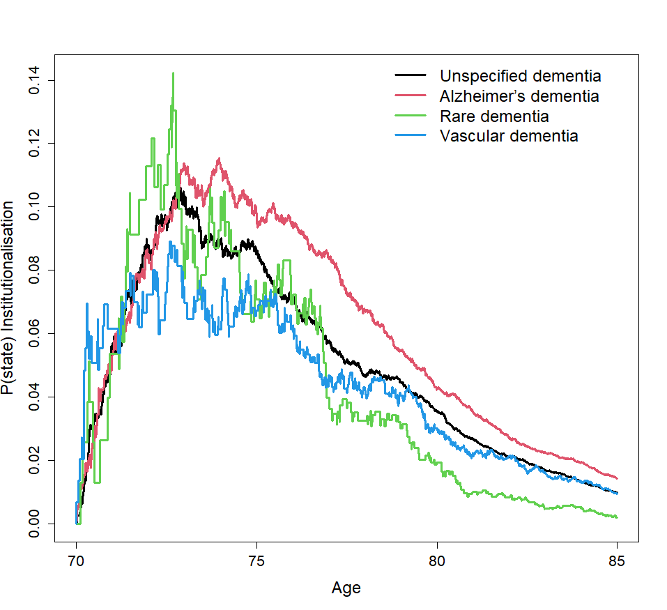

```{r setup, include = FALSE}
library(knitr)
library(tidyverse)
library(nhsrtheme)
library(xaringanExtra)
library(survival)
xaringanExtra::use_panelset()
# set default options
opts_chunk$set(echo = FALSE,
               fig.width = 7.252,
               fig.height = 4,
               dpi = 300)
xaringanExtra::use_tile_view()
use_share_again()
xaringanExtra::style_share_again(share_buttons = c("twitter", "linkedin", "pocket"))


# 
# uncomment the following lines if you want to use the NHS-R theme colours by default
# scale_fill_continuous <- partial(scale_fill_nhs, discrete = FALSE)
# scale_fill_discrete <- partial(scale_fill_nhs, discrete = TRUE)
# scale_colour_continuous <- partial(scale_colour_nhs, discrete = FALSE)
# scale_colour_discrete <- partial(scale_colour_nhs, discrete = TRUE)
```

class: title-slide, left, bottom

# `r rmarkdown::metadata$title`
----
## **`r rmarkdown::metadata$subtitle`**
### `r rmarkdown::metadata$author`
### `r rmarkdown::metadata$date`

---
class: inverse, middle, center

# Aim of the study

---
class: middle

# The aim is to jointly model and explore the factors associated with institutionalisation directly from hospital, length of stay in hospital and time to institutionalisation and death from dementia diagnosis.

---


class: inverse, middle, center

# Study Design

---
class: middle

# A retrospective cohort design, describing the rates of hospital admissions, transition to an institution and death and the clinical factors affecting the rates of these events.

---

## Structure of the model


???
This model concern both hospitalisations and institutionalisation and will evaluate the factors associated with transition into an institution with respect to repeated hospitalisation or death.
---

###Covariates used 

* **Sex**

* **Age (<75, 75-85, 85+)**

* **Homecare availability **

* **Dementia subtypes (Alzheimer's dementia, rare dementia, Vascular dementia & Unspecified)**

* **Exposure to anti-diabetic drugs a year before dementia diagnosis**

* **Exposure to anti-cardiovascular drugs one year before dementia diagnosis**

* **Frailty Index scores (Fit, Mild frailty, Moderate frailty, Severe frailty)**

* **Charlson comorbidity Index (CCI): CCI = 0, CCI 1-2, CCI 3-4,and CCI  => 5**

* **Index of multiple deprivation (IMD)**

* **Length of hospital stay : >= 12 days (Y/N)**

* **Admission due to injury (Y/N)**

*  **30 days readmission **

* **30 day readmission, Length of stay, admission due to injury, Charlson score (CCI), and frailty score (eFI), were used as time-varying covariates**.


---

class: inverse, middle, center

# Results

---


---


class: inverse, middle, center

# State occupation probabilities
 ## Aalen-Johansen P(t) curves## 

---

* *With home care availability the chance of being institutionalised or dead are lowered*

.pull-left[]

.pull-right[]

---


* **The availability of home care to dementia patients with CVD complications give them the rate of those with no CVD complications **


---



* **Patients with Vascular dementia were admitted to an institution early compared to Alzheimer’s and unspecified dementia patients, they had a shorter life expectancy due to their transition to death **


---


With increasing frailty the probability of being in an institution decreases because of their high rate of mortality with increasing frailty.


---


* Dementia patients who had hospital admissions due to an injury transition to institution very quickly and their probability of death is also higher.

.pull-left[]

.pull-right[]

---


* Dementia patients who had hospital admissions due to an injury transition to isntitution very quickly and their probability of death is also higher.

.pull-left[]

.pull-right[]

---


* Hospital readmission within 30 days from the previous discharge were at higher probability to be institutionalised during the first two years after dementia diagnosis after which the probability of being in institution decreases drastically due to their higher mortality rate.


---
class: inverse, middle, center

# Predicted time in state curves
 ##Predicted survival curves## 
---
class:  middle, center
* **For predicted survival curves, we use the same `survfit()` call as Aalen-Johansen**


---


* Aalen-Johansen curves post Cox model (Cumulative hazard curves) : Predicted probability in state curves 


---


---
class: inverse, middle, center

# Sojourn times
 ##Restricted mean survival time (RMST)## 
---
###Restricted mean survival time for Male/Female dementia patients


---


#### RMST for patients with and without homecare availability and whether suffering from CVD complications or not


---


#Summary

* **Male dementia patients were at greater risk of hospital readmission,  and death**

* **Increasing age was associated with institutional discharge directly from hospital and death **

* **Female dementia patients were more likely to be institutionalised compared to men**

* **AD and VaD were associated with institutionalisation**

* **Patients with home care availability were spending less time in hospital, were less likley to be discharged to institution and their hazard of death was significantly lower as well.**

* **Patient who were also on anti-cardiovascular drugs had a greater risk of dying inside hospital as well as in institutional care**

* **Hospital readmissions increased with increasing frailty and increased comorbidity burden**

* **Increased hazard of Institutionalisation was also associated  increasing frailty**

* **Higher socio-economic deprivation was associated with  increased rate of hospital readmission, institutionalisation and death inside hospital**

* **Admission due to injury and long hospital stays increased the risk of institutionalisation and death**


         
