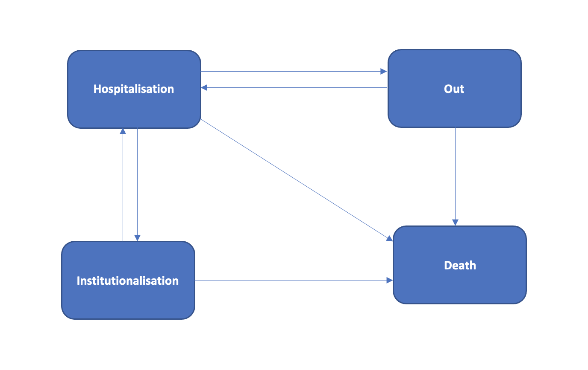
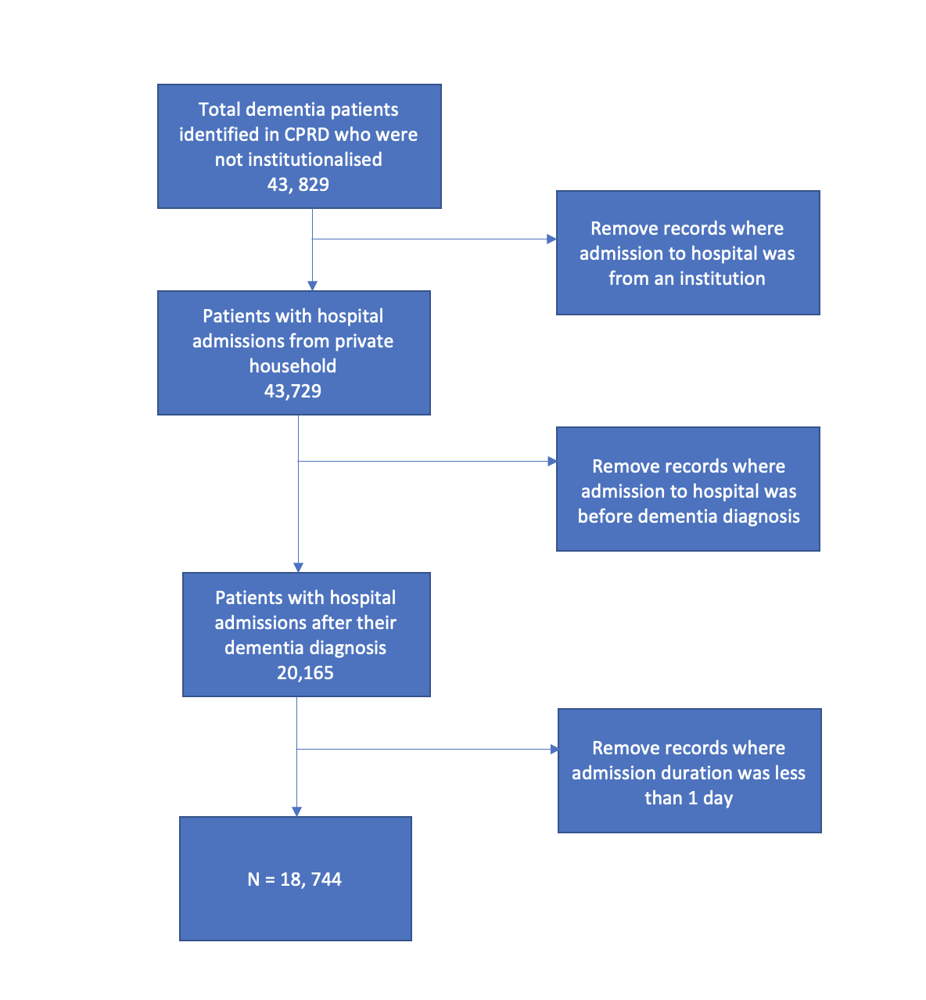
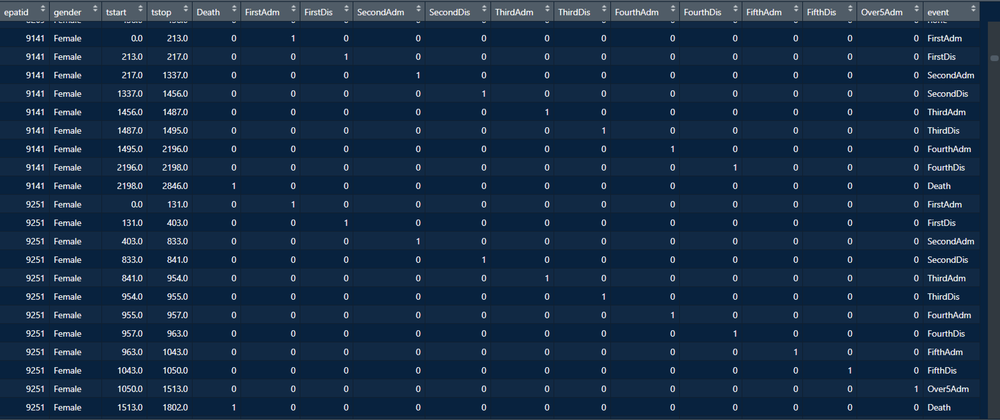

```{r setup, include = FALSE}
library(knitr)
library(tidyverse)
library(nhsrtheme)
library(xaringanExtra)
library(survival)
xaringanExtra::use_panelset()
# set default options
opts_chunk$set(echo = FALSE,
               fig.width = 7.252,
               fig.height = 4,
               dpi = 300)
xaringanExtra::use_tile_view()
use_share_again()
xaringanExtra::style_share_again(share_buttons = c("twitter", "linkedin", "pocket"))


# 
# uncomment the following lines if you want to use the NHS-R theme colours by default
# scale_fill_continuous <- partial(scale_fill_nhs, discrete = FALSE)
# scale_fill_discrete <- partial(scale_fill_nhs, discrete = TRUE)
# scale_colour_continuous <- partial(scale_colour_nhs, discrete = FALSE)
# scale_colour_discrete <- partial(scale_colour_nhs, discrete = TRUE)
```

class: title-slide, left, bottom

# `r rmarkdown::metadata$title`
----
## **`r rmarkdown::metadata$subtitle`**
### `r rmarkdown::metadata$author`
### `r rmarkdown::metadata$date`

---
class: inverse, middle, center

# Aim of the study

---
class: middle

# The aim is to jointly model and explore the mediators associated with institutionalisation, hospital readmissions and mortality, and examine the effects of dementia patients profiles on the transitions between these states.

---


class: inverse, middle, center

# Study Design

---
class: middle

# A retrospective cohort design, describing the rates of repeated hospital admissions, transition to an institution and death and the clinical factors affecting the rates of these events.

---

class: inverse, middle, center

# What Modelling approach and Why ?

---
class: middle, center

* **A multi-state modelling approach because standard time-to-event analysis such as Cox PH only takes into account time to first event and ignore the subsequent events**.

--

* **Various counting process or gap time models also has the limitation of treating terminal event such as death as censored, implying that the patients are still at risk of experiencing further recurrent events.**

--

* **To overcome these a MSM is recommended - it models the terminal event as an absorbing state, since no recurrent events can occur after this.**


---

# Structure of the model




???
This model concern both hospitalisations and institutionalisation and will evaluate the factors associated with transition into an institution with respect to repeated hospitalisation or death.
---

class: inverse, middle, center

# Multi-state data

---
class: middle


* **In ordinary survival data we have : time , status**


--


*  **In multi-state : time1, time2 and the status is a multi-level factor variable**


???
So, instead of covariates changing from line to line as in ordinary survival analysis, in MSM the status variable changes; it contains the state that was entered at time2.
--

* **We will need an id variable to indicate which rows of the data frame belong to each subject.**
--

---
# Stusy cohort selection





---
class: center, middle
```{r, echo = TRUE}
states <- c("Transplant", "Platelet recovery", 
            "Relapse or death")
tmat <- matrix(0, 3,3, dimnames=list(states, states))
tmat[1,2] <- tmat[1,3] <- tmat[2,3] <- 1 # arrows
statefig(cbind((1:3)/4, c(1,3,1)/4), tmat)
```

---
class: inverse, middle, center


# Multi-state model using `ebmt3` data

---
# Create the analysis data
```{r statefig2, echo=TRUE}

edata <- tmerge(ebmt3[, c("id", "age", "dissub", "drmatch", "tcd")],ebmt3, id = id, 
                rstat = event(rfstime, rfsstat),
                pstat = event(prtime, prstat),
                priorpr = tdc(prtime))

print(edata[15:20, -(3:5)])


```
???
Subject 8 and 11 achieve PR, subject 9 is censored at 3.5 years(1264/365) and subject 10 dies at about 1 year. Important to note that prior PR (priorpr) lags the PR event.TDC apply from the start of a new interval and persist for all remaining intervals. Events occur at the end of an interval and only occur once.
---
class: inverse, middle, center

# Creating the factor outcome

---
### Make the event variable a factor and run `survcheck()`###
.pull-left[
```{r echo = TRUE}
edata$event <- with(edata, factor(pstat + 2*rstat, 0:2,
                                  labels = c("censor", "PR", "RelDeath")))
levels(edata$drmatch) <- c("Match", "Mismatch")


```
]

.pull-right[
```{r}
survcheck(Surv(tstart, tstop, event) ~ 1, data = edata, id = id)
```
]
???
The survcheck is very important check of the data. The transition table shows that 577 out of 2204 subjects had neither PR or failure by the end of fu while 383 experienced both. Most importantly no one goes from death to anywhere else.
---
class: inverse, middle, center

 ## Aalen-Johansen P(t) curves## 
---
 .panelset[
.panel[.panel-name[fit 1]

```{r, echo= TRUE}
surv1 <- survfit(Surv(tstart, tstop, event) ~ 1, edata, id = id)
surv1$transitions
```

.panel[.panel-name[plot 1]

```{r}
plot(surv1, col = 1:2, xscale = 365.25 , lwd = 2,
     xlab = "Years since transplant" , ylab = "Fraction in state")
legend(1000, .2, c("Platelet recovery", "Death or Relapse"),
       lty = 1, col = 1:2, lwd = 2, bty = 'n')
```

]
]
]
???
For survival curves or "times probability is state" curves. Its a generalisation of KM.It measure how many people are in each box or state at any given time.
The plot shows the rapid onset of PR followed by a slow but steady conversion of these patients to Relapse or Death.
---
class: inverse, middle, center

 ## Transition-specific covariate effect estimation## 
 
---
.panelset[
.panel[.panel-name[coxph]

```{r,echo=TRUE}
efit1 <- coxph(Surv(tstart, tstop, event) ~ dissub + age + drmatch + tcd, 
               id = id , data = edata, ties = "breslow")

```
.panel[.panel-name[coefficients]
```{r}

print(efit1, digits = 2)
```

.panel[.panel-name[Baseline Hazard]
```{r, echo=FALSE}
# Now draw the figure for baseline hazards
# a dataset containing the 'reference' categories 

rdata <- data.frame(dissub = "AML", age = "<=20" , "drmatch" = "Match" , tcd = "No TCD" )

esurv1 <- survfit(efit1, newdata = rdata)
plot(esurv1, cumhaz = TRUE, lty = 1:3, xscale = 365.25, xmax = 7*365.25,
xlab = "Years since transplant", ylab = "Cumulative hazard")
legend(365, .8, c("Transplant to platelet recovery (1:2)",
                  "Transplant to death (1:3)",
                  "Platelet recovery to death (2:3)"), lty = 1:3, bty = 'n')
```

]
]
]
]

???
Model without any proportionality assumption on baseline hazard.This estimate separate baseline hazard for each transition.
---
class: inverse, middle, center

 ## Proportional hazard model## 
 
---

.panelset[
.panel[.panel-name[proportional Hazard]
```{r, echo=TRUE}
efit2 <- coxph(list(Surv(tstart, tstop, event) ~ dissub + age + drmatch + tcd,
               0:state("RelDeath") ~ 1 / common,
               "PR":"RelDeath" ~ priorpr),
               id = id, data = edata, ties = "breslow")

```


.panel[.panel-name[Coefficients]
```{r}
print(coef(efit2, type = "matrix"), digits = 2)
```

]
]
]

???
We can assume transitions 1:3 and 2:3 to be proportional. They have a shared baseline hazard because they terminate into the same state. Here we use 1 to show these transitions have a common intercept and adding the intermediate event of PR as a tdc as priorpr.
The priorpr value for all the data rows at risk of 2:3 transition is 1 and for 1:3 is 0.
Pletelet recovery (priorpr) has a protective effect on relapse-free survival.

---
class: inverse, middle, center

 ## Prediction## 
 
---
.panelset[
.panel[.panel-name[Prediction model]
```{r, echo=TRUE}
edummy <- expand.grid(age = "<=20", dissub = "AML", drmatch = "Mismatch",
                      tcd = c("No TCD", "TCD"), priorpr = 1)

ecurve2 <- survfit(efit2, newdata = edummy)
```

.panel[.panel-name[Predition probabilities plot]
```{r}
plot(ecurve2, col=c(1,1,3,3,5,5), lty=1:2, lwd=2, xscale=365.25,
     noplot=NULL, 
     xlab="Years since transplant", ylab="Predicted probabilities")
legend(700, .9, c("Currently alive in remission, no PR", "Currently in PR",
                  "Relapse or death"), col= c(1,3,5), lwd=2, bty='n')
text(700, .95, "Solid= No TCD, dashed = TCD", adj=0)
```

]
]
]

???
we will now predict the future state of a patient, using as our reference set two subjects who are 
<= 20 years old, gender matched, AML, with and without T-cell depletion.
we will use the fit from the proportional hazard model for the transitions to Relapse/Death and 
a separate baseline hazard for the PR transition
---
class: inverse, middle, center

 ## Data structure for the first model## 
 
---
<!--  -->


