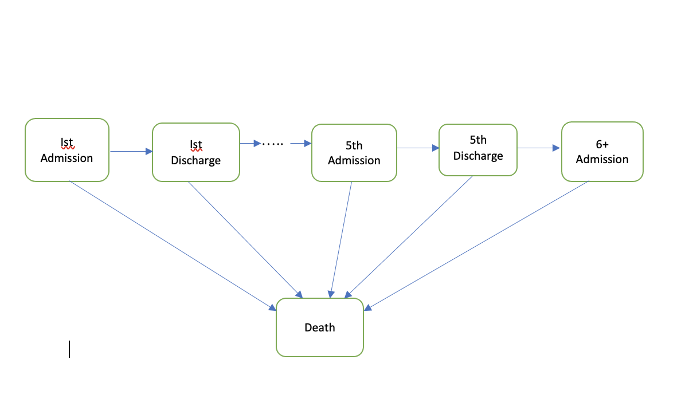
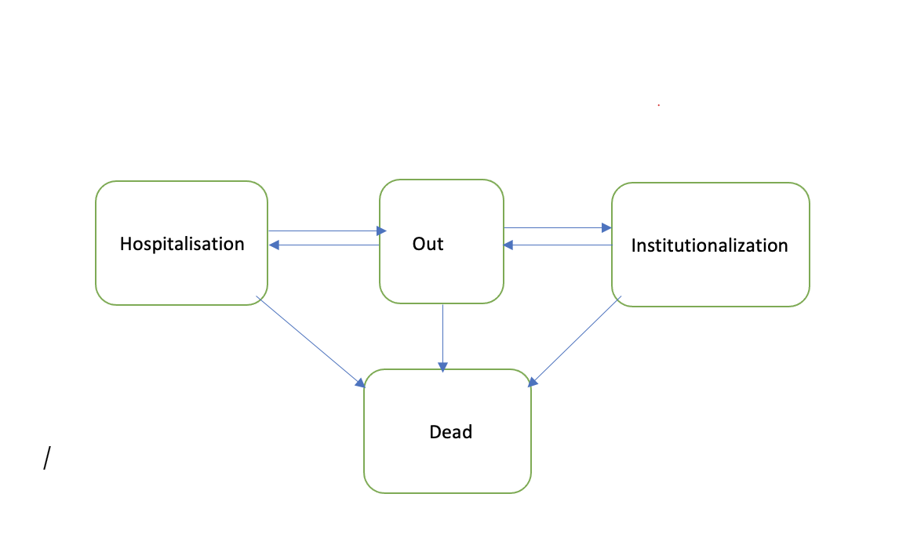

```{r setup, include = FALSE}
library(knitr)
library(tidyverse)
library(nhsrtheme)
library(xaringanExtra)
library(survival)
xaringanExtra::use_panelset()
# set default options
opts_chunk$set(echo = FALSE,
               fig.width = 7.252,
               fig.height = 4,
               dpi = 300)
xaringanExtra::use_tile_view()
use_share_again()
xaringanExtra::style_share_again(share_buttons = c("twitter", "linkedin", "pocket"))


# 
# uncomment the following lines if you want to use the NHS-R theme colours by default
# scale_fill_continuous <- partial(scale_fill_nhs, discrete = FALSE)
# scale_fill_discrete <- partial(scale_fill_nhs, discrete = TRUE)
# scale_colour_continuous <- partial(scale_colour_nhs, discrete = FALSE)
# scale_colour_discrete <- partial(scale_colour_nhs, discrete = TRUE)
```

class: title-slide, left, bottom

# `r rmarkdown::metadata$title`
----
## **`r rmarkdown::metadata$subtitle`**
### `r rmarkdown::metadata$author`
### `r rmarkdown::metadata$date`

---
class: inverse, middle, center

# Aim of the study

---
class: middle

# The aim is to jointly model disease progression, mortality, and their relationship with patient’s characteristics to understand the prognosis of dementia patients.

---


class: inverse, middle, center

# Study Design

---
class: middle

# A retrospective cohort design, describing the rates of repeated hospital admissions, transition to an institution and death and the clincal factors affecting the rates of these events.

---

class: inverse, middle, center

# What Modelling approach and Why ?

---
class: middle, center

* **A multi-state modelling approach because standard time-to-event analysis such as Cox PH only takes into account time to first event and ignore the subsequent events**.

--

* **Various counting process or gap time models also has the limitation of treating terminal event such as death as censored, implying that the patients are still at risk of experiencing further recurrent events.**

--

* **To overcome these a MSM is recommended - it models the terminal event as an absorbing state, since no recurrent events can occur after this.**


???
This model represent subsequent periods spent in and out of hospital.how the risk of death and further hospitalisation changes through time.

---
# Structure of the first model

--



??? 


This model represent subsequent periods spent in and out of hospital. This will allow us to model how the risk of death and further hospitalisation changes through time.

---


# Structure of the second model




???
This model concern both hospitalisations and institutionalisation and will evaluate the factors associated with transition into an institution with respect to repeated hospitalisation or death.
---

class: inverse, middle, center

# Multi-state data

---
class: middle


* **In ordinary survival data we have : time , status**


--


*  **In multi-state : time1, time2 and the status is a multi-level factor variable**


???
So, instead of covariates changing from line to line as in ordinary survival analysis, in MSM the status variable changes; it contains the state that was entered at time2.
--

* **We will need an identified variable to indicate which rows of the data frame belong to each subject.**
--


---
class: center, middle
```{r, echo = TRUE}
survival::myeloid %>% 
head() %>% 
  knitr::kable(format = "html")
```

---

# Multi-state using `myeloid` data

* `futime`, `death` - time to death or last follow-up (death)
* `txtime` - time to  stem cell transplant (SCT)
* `crtime` - time to complete response (CR)
* `rltime` - time to relapse of disease (relapse)

First look at a simple multi-state diagram for the myeloid data.

```{r statefig2, echo=FALSE}
# illness-death model
states <- c("Initial", "CR","Death")
cmat <- matrix(0L, 3, 3, dimnames = list(states, states))
cmat[1,] <- 1
cmat[2,3] <- 1
statefig(c(1,2), cmat)
```

---
class: inverse, middle, center

# Creating the data set

---
class: middle, center
###We create the counting process dataset using the `tmerge` function###


```{r echo = TRUE}
mdata <- tmerge(myeloid[, c("id" , "trt", "sex")],
                myeloid, id= id,
                death = event(futime, death), cr = event(crtime))

head(mdata)
 
```
---
class: inverse, middle, center

 ## Adding a time-dependent covariate## 
---
```{r echo = TRUE}
mdata <- tmerge(mdata, myeloid, id= id, priortx = tdc(txtime))
mdata[1:7, ]
 
```
```{r, echo=TRUE}
summary(mdata)
```

---
class: inverse, middle, center

 ## Create a factor for the multi-state outcome## 
 
---

```{r, echo=TRUE}

mdata$event <- with(mdata, factor(cr + 2*death, levels = 0:2,
                       labels = c("none", "CR", "Death")))


head(mdata)
```
???
If the CR time is missing, then use the death indicator and multiply it by 2 so we get a numeric value of 2 for those where dead and 0 otherwise and those that have a CR will get a value of 1.


---

```{r}
# survcheck(Surv(tstart, tstop, event)~ 1, id = id , data = mdata)
```

---
class: inverse, middle, center

 ## Data structure for the first model## 
 
---
<!--  -->


