```{r setup, include = FALSE}
library(knitr)
library(tidyverse)
library(nhsrtheme)
library(xaringanExtra)
library(survival)
xaringanExtra::use_panelset()
# set default options
opts_chunk$set(echo = FALSE,
               fig.width = 7.252,
               fig.height = 4,
               dpi = 300)
xaringanExtra::use_tile_view()
use_share_again()
xaringanExtra::style_share_again(share_buttons = c("twitter", "linkedin", "pocket"))


# 
# uncomment the following lines if you want to use the NHS-R theme colours by default
# scale_fill_continuous <- partial(scale_fill_nhs, discrete = FALSE)
# scale_fill_discrete <- partial(scale_fill_nhs, discrete = TRUE)
# scale_colour_continuous <- partial(scale_colour_nhs, discrete = FALSE)
# scale_colour_discrete <- partial(scale_colour_nhs, discrete = TRUE)
```

class: title-slide, left, bottom

# `r rmarkdown::metadata$title`
----
## **`r rmarkdown::metadata$subtitle`**
### `r rmarkdown::metadata$author`
### `r rmarkdown::metadata$date`

---
class: inverse, middle, center

# Aim of the study

---
class: middle

# The aim is to jointly model and explore the mediators associated with institutionalisation, hospital readmissions and mortality, and examine the effects of dementia patients profiles on the transitions between different states.

---


class: inverse, middle, center

# Study Design

---
class: middle

# A retrospective cohort design, describing the rates of repeated hospital admissions, transition to an institution and death and the clinical factors affecting the rates of these events.

---

class: inverse, middle, center

# What Modelling approach and Why ?

---
class: middle, center

* **A multi-state modelling approach because standard time-to-event analysis such as Cox PH only takes into account time to first event and ignore the subsequent events**.

--

* **Various counting process or gap time models also has the limitation of treating terminal event such as death as censored, implying that the patients are still at risk of experiencing further recurrent events.**

--

* **To overcome these a MSM is recommended - it models the terminal event as an absorbing state, since no recurrent events can occur after this.**


---

# Structure of the model


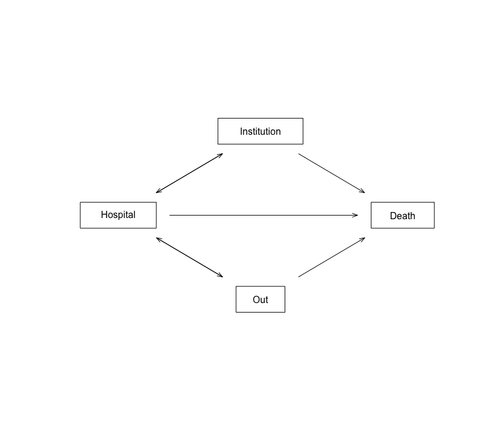

???
This model concern both hospitalisations and institutionalisation and will evaluate the factors associated with transition into an institution with respect to repeated hospitalisation or death.
---

class: inverse, middle, center

# Multi-state data

---
class: middle


* **In ordinary survival data we have : time , status**


--


*  **In multi-state : time1, time2 and the status is a multi-level factor variable**


???
So, instead of covariates changing from line to line as in ordinary survival analysis, in MSM the status variable changes; it contains the state that was entered at time2.
--

* **We will need an id variable to indicate which rows of the data frame belong to each subject.**
--
---
class: inverse, middle, center

# Data structure

---

.panelset[

.panel[.panel-name[Data]
.pull-left[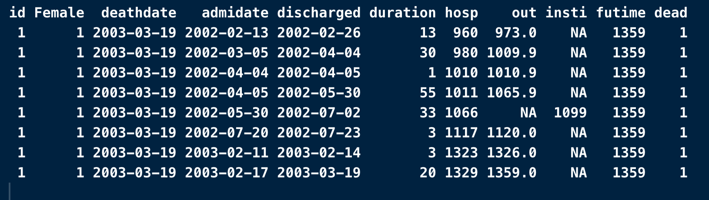]
.pull-right[
* **For example if this is the data for an example patient with time of admission, discharge and death .**
]


.panel[.panel-name[Counting process data]
.pull-left[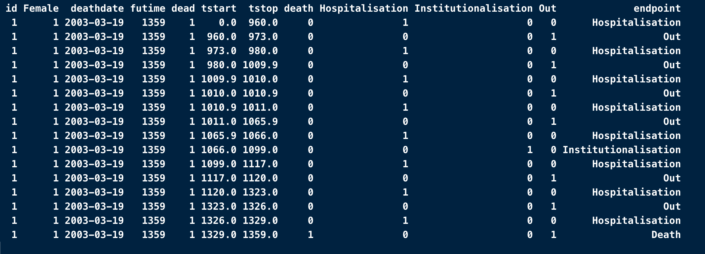]

.pull-right[

]


* **Using `tmerge` function, we can create a counting process data structure where each row correspond to an event such as hospitalisation, discharge, institutionalisation etc.**


]

]
]

---
## Study cohort selection


---
##Covariates used 

* **Sex**

* **Dementia subtypes (Alzheimer's dementia, Vascular dementia & Unspecified/rare dementia)**

* **Exposure to anti-diabetic drugs a year before dementia diagnosis**

* **Exposure to anti-cardiovascular drugs one year before dementia diagnosis**

* **Frailty Index scores (Fit, Mild frailty, Moderate frailty, Severe frailty)**

* **Charlson comorbidity Index (CCI): CCI < 2, =2 and >2**

* **Index of multiple deprivation (IMD)**

* **Length of hospital stay : >= 12 days (Y/N)**

* **Admission due to injury (Y/N)**


* **Length of stay and admission due to injury were used as time-varying covariates**.

---

##Outcomes 


 **The outcomes of interest were**
 
 
 
 
 * **All-cause hospitalisations**
 
 * **Institutionalisation**
 
 * **All-cause death**


---

###Statistical analysis 


* **Multi-state Cox model using R survival library**

* **To investigate the covariates effect on each specific transition between two states**

* **Each transition in the MSM is a Cox type regression model**

* **We get the hazard ratios (HR) for each covariate effect on different transitions**

* **We also can estimate the probabilities of people in a particular state at a particular time**

* **Also, the time spent in each state by patients with specific profiles. Which is the sojourn time or the restricted mean survival time (RMST)**

---

class: inverse, middle, center

# Results
---
###Hospital to institutionalisation (State 2 --> State 3)


---
###Hospital discharge (Hospital -->  Out) State 2 --> State 4
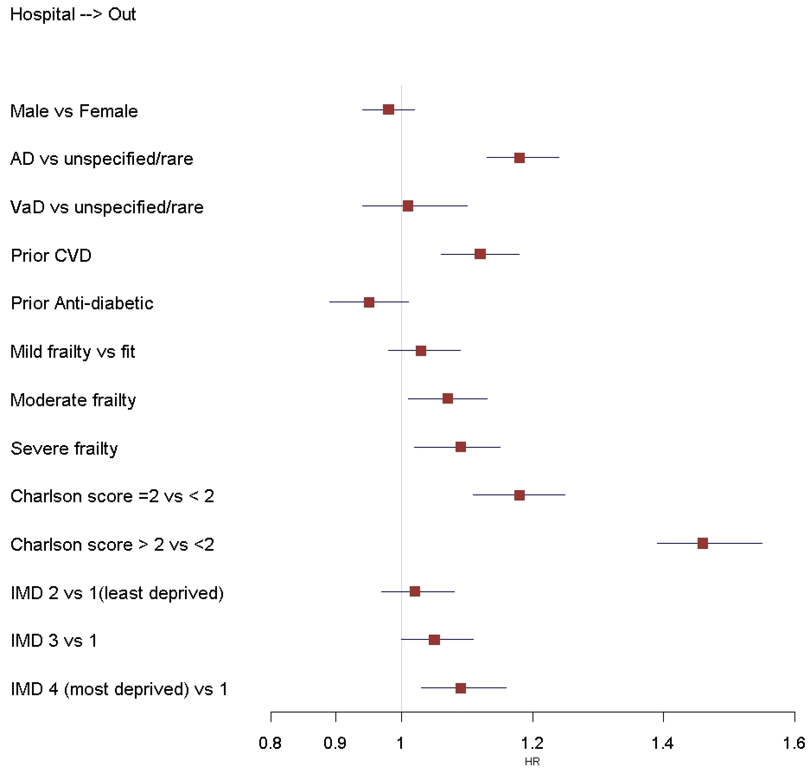

---

###Hospital readmission: State 4 --> State 2


---


###Death inside hospital: State 2 --> State 5


---
class: inverse, middle, center

# State occupation probabilities
 ## Aalen-Johansen P(t) curves## 
---


.panelset[

.panel[.panel-name[Age scale]
.pull-left[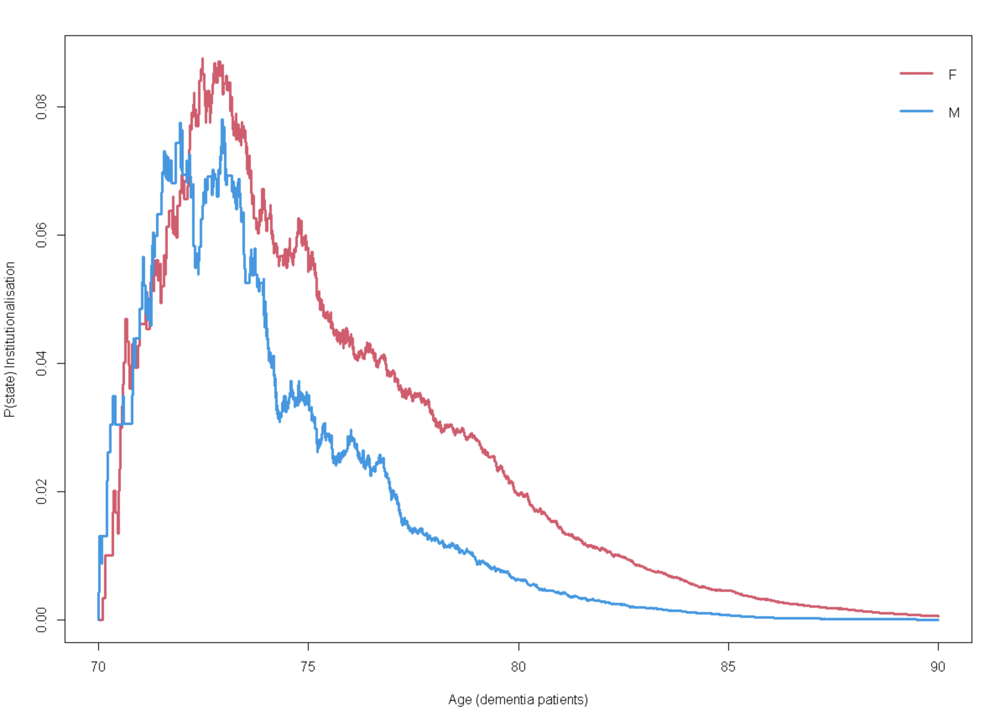]
.pull-right[
* **Probability in state curves indicate the probability of being in a state by time.**
* **More women are discharged into an institution. Also, men are transitioned quickly to death or readmitted to hospital, as they spend less time inside institution**]

.panel[.panel-name[Time since diagnosis]
.pull-left[]
]

]
]

---
.panelset[

.panel[.panel-name[Injury Admission]
.pull-left[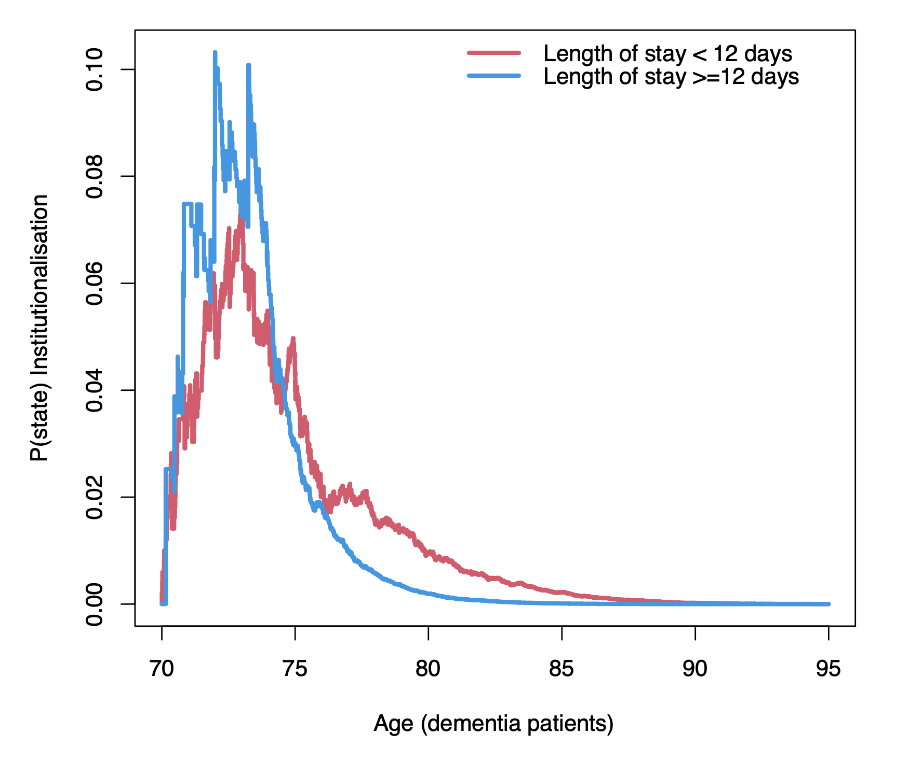]
.pull-right[
* **Probability of institutionalizatin increases with long stay hospital admissions.**
* **People with long stay admission also transition quckly to death.**
]

.panel[.panel-name[Injury adm + Long stay]
.pull-left[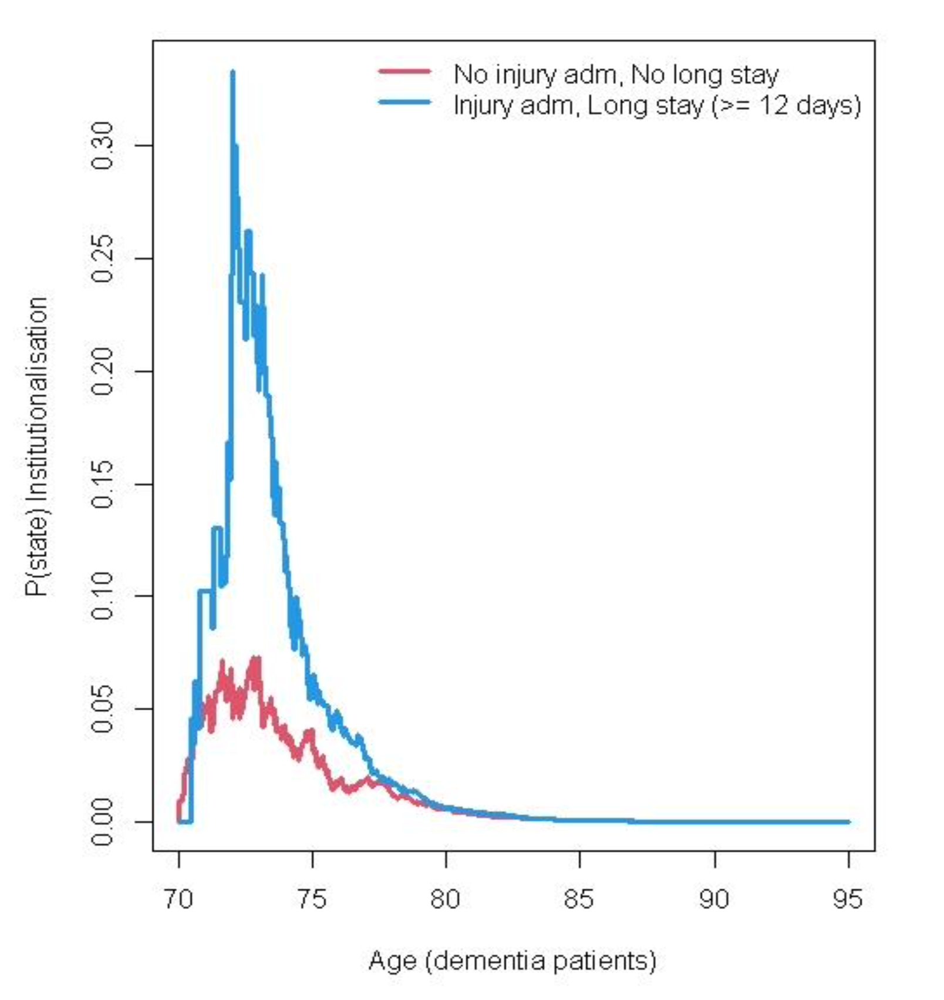]
.pull-right[
* **With Long stay admission and also admission due to injury, the probability of being institutionalised increases from 10% to more than 30%**

]
]

]
]
---
.pull-left[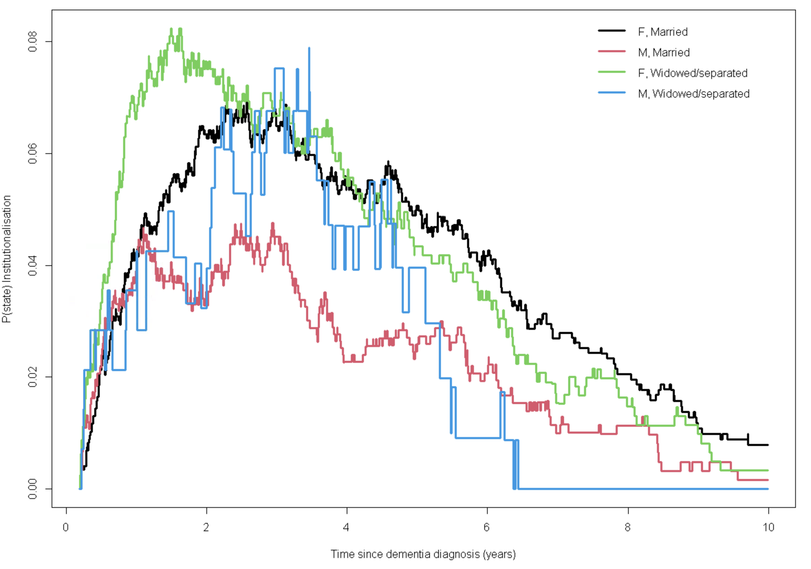]
.pull-right[
* **Probability of being institutionalised for dementia patients who were widowed/separated were higher compared to married patients especially in the first 4-5 years after diagnosis **

]
---

.pull-left[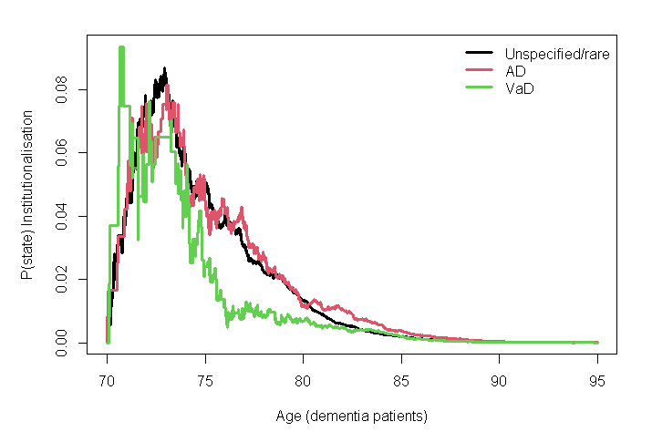]
.pull-right[
* **Patients with Vascular dementia were admitted to an institution early compared to Alzheimer’s and unspecified dementia patients, they had a shorter life expectancy due to their transition to death **

]
---
.pull-left[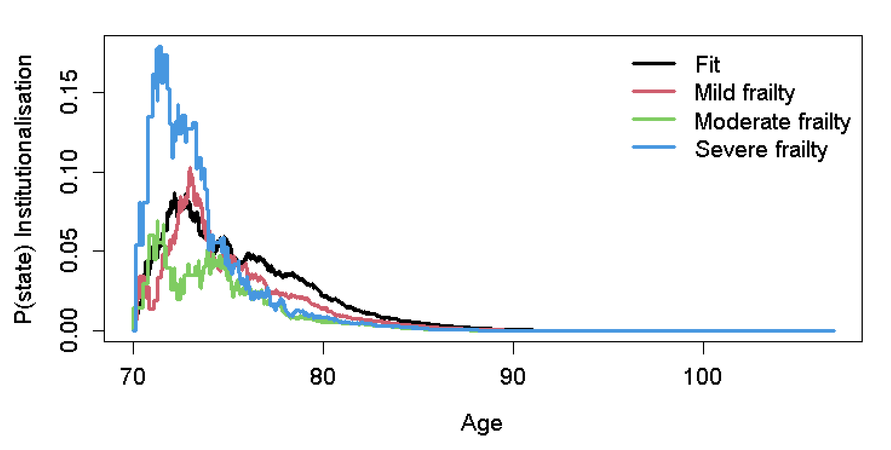]
.pull-right[


]


* **The state occupation probability starting at age 70 shows that more patients with severe frailty are in institution between the ages of 70-76. **
---
class: inverse, middle, center

# Predicted time in state curves
 ##Predicted survival curves## 
---
class:  middle, center
* **For predicted survival curves, we use the same `survfit()` call as Aalen-Johansen**

* **However, we need a target value of x**

* **Similar to in ordinary Cox model for example, with age and sex covariates,and we want to predict a survival curve, we have to provide values for a particular age and sex.**
---

.pull-left[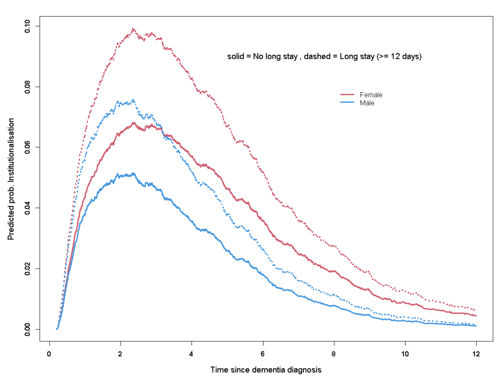]
.pull-right[


]


* **The predicted effect of hospital long-stay admissions is to increase the occupancy of institutionalisation state for both men and women, especially in the first 2-5 years after dementia diagnosis**
---
class: inverse, middle, center

# Sojourn times
 ##Restricted mean survival time (RMST)## 
---
###Restricted mean survival time for Male/Female dementia patients

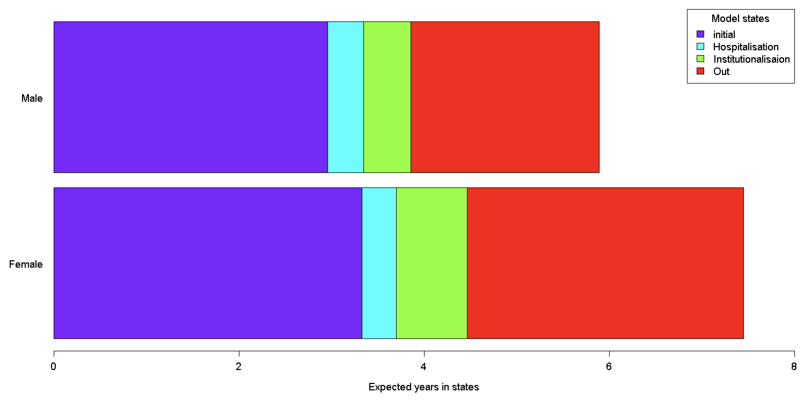
---

###RMST for Male/Female dementia patients with and without injury admission

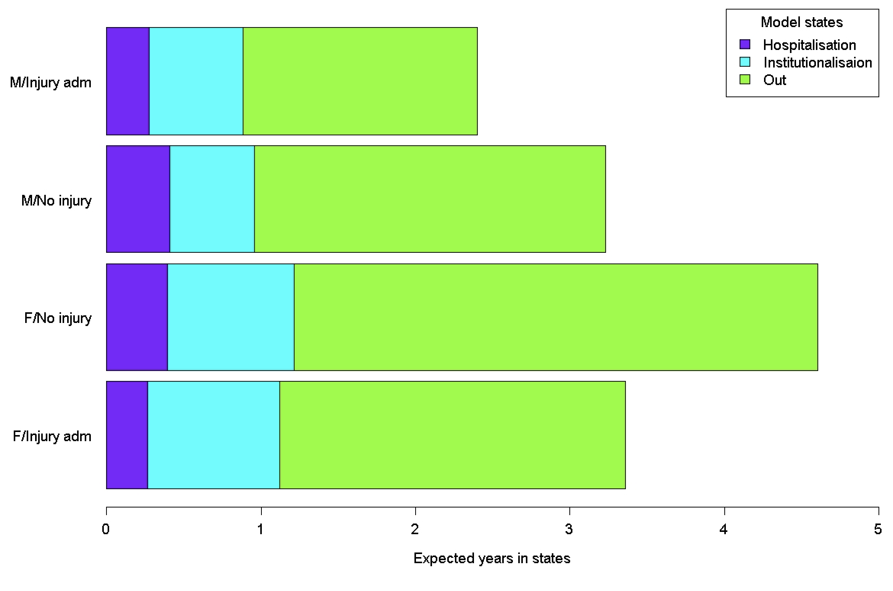
---

###RMST for Male/Female dementia patients with and without long-stay admission

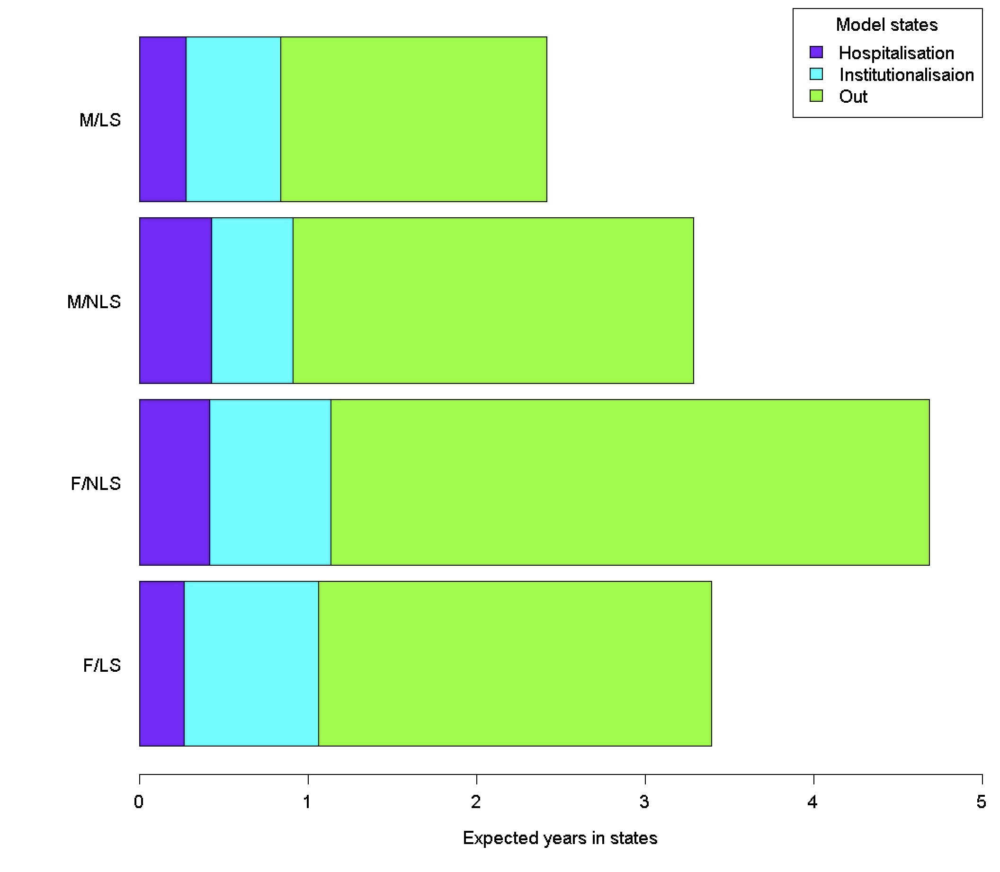
---

#Summary

* **Male dementia patients were at greater risk of hospital readmission,  and death**

* **Female dementia patients were more likely to be institutionalised compared to men**

* **Patient who were also on anti-cardiovascular drugs had a greater risk of dying inside hospital as well as in institutional care**

* **Hospital readmissions increased with increasing frailty and increased comorbidity burden**

* **Institutionalisation decreased with increasing frailty and increasing comorbidity score**

* **With increased socio-economic deprivation, hospital readmission also increased**

* **Admission due to injury and long hospital stays increased the risk of institutionalisation and death**


          **************************************************************************
